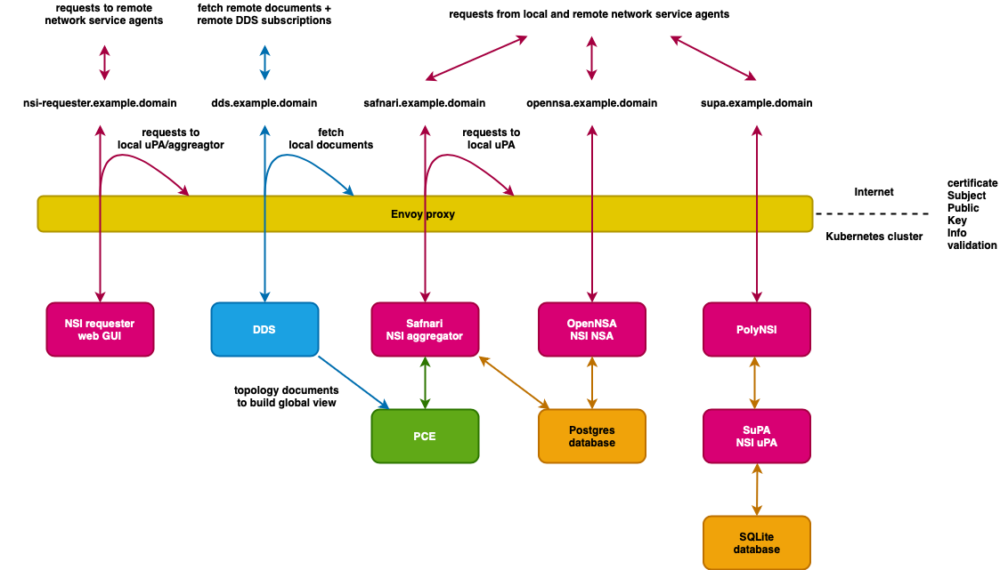

# NSI-node

NSI-node is a [Helm](https://helm.sh/) chart to install a configurable
combination of the NSI aggregator
[Safnari](https://github.com/BandwidthOnDemand/nsi-safnari) and
[PCE](https://github.com/BandwidthOnDemand/nsi-pce), [Document Distribution
Service](https://github.com/BandwidthOnDemand/nsi-dds), network service agent
[OpenNSA](https://github.com/BandwidthOnDemand/nsi-opennsa), ultimate provide agent
[SuPA](https://github.com/workfloworchestrator/SuPA) in combination with NSI SOAP/gRPC proxy
[PolyNSI](https://github.com/workfloworchestrator/PolyNSI), and
[NSI requester client](https://github.com/BandwidthOnDemand/nsi-requester), together with a
[Postgresql](https://bitnami.com/stack/postgresql/helm) database and
[Envoy](https://github.com/BandwidthOnDemand/nsi-envoy) proxy for access
authorisation.



**Table of Contents**

* [Known issues](#known-issues)
* [How it works in a nutshell](#how-it-works-in-a-nutshell)
  * [Distributed Document Service (DDS)](#distributed-document-service-dds)
  * [Patch Computation Element (PCE)](#patch-computation-element-pce)
  * [Safnari NSI Aggregator](#safnari-nsi-aggregator)
  * [OpenNSA NSI uPA](#opennsa-nsi-upa)
  * [SuPA NSI uPA and PolyNSI](#supa-nsi-upa-and-polynsi)
  * [NSI Requester Web GUI](#nsi-requester-web-gui)
  * [PostgreSQL database](#postgresql-database)
  * [Envoy proxy](#envoy-proxy)
* [Installation](#installation)
  * [Helm chart repositories](#helm-chart-repositories)
  * [NSI\-node chart](#nsi-node-chart)
  * [Helm deployment values](#helm-deployment-values)
* [Configuration](#configuration)
  * [Folder layout](#folder-layout)
  * [Enable/disable applications](#enabledisable-applications)
  * [Certificates](#certificates)
  * [Application configuration files](#application-configuration-files)
  * [Expose node to the outside world](#expose-node-to-the-outside-world)
* [Deploy](#deploy)
  * [Check certificates and chains](#check-certificates-and-chains)
  * [Create chart configuration](#create-chart-configuration)
  * [Install or upgrade deployment](#install-or-upgrade-deployment)
* [Debug](#debug)
  * [Envoy proxy](#envoy-proxy-1)

## Known issues

* nsi-safnari
  * [HTTP client does not do SNI](https://github.com/BandwidthOnDemand/nsi-safnari/issues/21)
* nsi-dds
  * [No available signature authentication scheme while deploying to Kubernetes](https://github.com/BandwidthOnDemand/nsi-dds/issues/11)

## How it works in a nutshell

A terse description on how an automated GOLE NSI node functions can be found
below. For more background information please have a look at the following
documents:

* [Network Services Framework v2.0](https://www.ogf.org/documents/GFD.213.pdf) 
* [Network Service Interface Signaling and Path Finding](https://www.ogf.org/documents/GFD.217.pdf)
* [Network Service Agent Description](https://www.ogf.org/documents/GFD.220.pdf)
* [NSI Authentication and Authorization](http://www.ogf.org/documents/GFD.232.pdf)
* [Applying Policy in the NSI Environment](https://www.ogf.org/documents/GFD.233.pdf)
* [Network Service Interface Signaling and Path Finding](http://www.ogf.org/documents/GFD.234.pdf)
* [NSI Connection Service v2.1](http://www.ogf.org/documents/GFD.237.pdf)
* [Error Handling in NSI CS 2.1](http://www.ogf.org/documents/GFD.235.pdf)
* [Network Service Interface Document Distribution Service](http://www.ogf.org/documents/GFD.236.pdf)

### Distributed Document Service (DDS)

The DDS serves as a central storage for all documents needed in a NSI
infrastructure. Currently two types of documents are hosted: discovery
documents of type  `vnd.ogf.nsi.nsa.v1+xml` and topology documents of type
`vnd.ogf.nsi.topology.v2+xml`. The DDS is configured to retrieve these
documents from Network Service Agents (NSA) and will periodically check for
updates. To reduce the data transport and processing overhead the
`If-Modified-Since` HTTP header is used during update checks. When a discovery
document is fetched the DDS will subsequently also automatically fetch all
topology documents mentioned in the discovery document.

The DDS also has a publish/subscribe interface to synchronise its content with
other DDS. This allows for redundancy, by having the same document fetched by
multiple DDS, and not every DDS needs to fetch every document itself, allowing
the setup of geographical or administrative zones.

A GUI is available at https://dds.example.domain/dds/portal to view the
following:

* Server Configuration: the NSA id and configured documents and subscriptions
* Subscription: from other DDS
* My Subscriptions: to other DDS
* Documents: all discovery and topology documents present at this DDS with the ability to view the contents

### Patch Computation Element (PCE)

The PCE fetches all topology documents present at the DDS to build a global
view of network connectivity. It does this by matching Service Termination
Points (STP) from all topology documents to form Service Demarcation Points
(SDP) where two topologies are connected. The PCE periodically checks the DDS
for updated documents and updates the connectivity graph as needed. The PCE
accepts path computation requests to find a path between a set of STP. It will
first check if the STP exist and then calculate the shortest path between them.
On success the PCE will return an ordered list of path segments, each segment
described by two STP in the same network, that together form a string of cross
connects that implement the requested connectivity.

Besides the STP connectivity graph the PCE also constructs a control plane
connectivity graph by matching the peersWith attributes from all discovery
documents. This allows for routing of NSI requests via other NSA if no direct
control plane connectivity exists.

### Safnari NSI Aggregator

The Safnari NSI Aggregator receives NSI requests, sends back a confirmation of
receipt in the same control plan connection, and in case of a synchronous
request will also send back the result in that same first connection. In case
of an asynchronous request the result is returned to the reply-to address in
the request after completion. In case of a reservation request the aggregator
asks the PCE to calculate a path, sends per path segment requests to child NSA,
receives the replies from child NSA and returns an aggregated state to the
requester. The discovery document of this NSA is located at
https://safnari.example.domain/nsa-discovery.

A GUI is available at https://safnari.example.domain that shows an overview of
the currently present connections. Per connections the overall state is shown
together with a complete log of every synchronous or asynchronous NSI message
received and sent.

### OpenNSA NSI uPA

OpenNSA is a NSI ultimate Provider Agent (uPA) that interfaces between NSI and
the local network. The pluggable backends allow for interfacing towards a local
Network Resource Manager (NRM) or talk directly to a local network element.
OpenNSA also has partial aggregation support that allows for hosting
multiple network topologies on a single OpenNSA instance. The discovery
document of this NSA is located at
https://opennsa.example.domain/NSI/discovery.xml.

OpenNSA uses the pluggable backend system to interface to the local network
resources. The OpenNSA topology configuration file maps STP and SDP to local
port identifiers and VLAN ranges.

### SuPA NSI uPA and PolyNSI

SuPA is a complete new NSI ultimate provider agent that uses modern design
patterns and implements the latest NSI protocol specification. It offers a gRPC
based version of the NSI protocol and is accompanied by PolyNSI that acts as a
NSI SOAP/gRPC proxy to interface with existing SOAP based NSA. It also has a
pluggable backend mechanism and offers both manual and automated topology
generation. The discovery document of this NSA is located at
https://supa.example.domain/NSI/discovery.

### NSI Requester Web GUI

The NSI Requester Web GUI is a NSI protocol debug tool that can be used to
construct and send NSI messages via a web GUI. Per message sent it shows the
message sent together with all synchronous and asynchronous messages received.
Support is available for reserve, commit, provision, release and terminate
primitives, as well as querying all connections and events.

### PostgreSQL database

A single PostgreSQL database is used to store the databases for Safnari and
OpenNSA. The same username and password is used by both.

### Envoy proxy

The Envoy proxy is the interface between the Kubernetes ingress or service
loadBalancer IP and the Kubernetes services in front of DDS, Safnari, OpenNSA
and NSI Requester. All TLS connections are terminated on the proxy. A per
application list of certificate Subject Public Key Information hashes is
maintained to check if a connecting client is allowed access or not.
Communication inside the cluster is plain HTTP.

For personal access to the GUI, API or documents served by all applications a
personal certificate needs to be configured per application.

## Installation

### Helm chart repositories

For Safnari, PCE, DDS, OpenNSA, Envoy and nsi-node add the NSI-node Helm chart
repository and for Postgresql add the Bitnami repository and update information
of available charts locally for the just added chart repositories:

```shell
helm repo add nsi-node https://bandwidthondemand.github.io/nsi-node/
helm repo add bitnami https://charts.bitnami.com/bitnami
helm repo update
```

### NSI-node chart

There are several ways to use the NSI-node chart, for example use a local copy
of the chart, or if you want to maintain your NSI-node configuration in a
separate repository you can add the NSI-node chart as a Git submodule. But any
other way that suites you purpose will work as well of course. 

#### Local copy

Clone the NSI-node repository and add your configuration to the config/ folder:

```shell
git clone https://github.com/BandwidthOnDemand/nsi-node.git
```

Changes to the config/ and chart/ folders are ignored by git.

#### Configuration repository

Create a new Git repository for you configuration and add the NSI-node chart as
a git submodule. If you for example use the GitLab auto deploy capabilities you
want the submodule to reside inside the charts folder, but any folder will do.

```shell
mkdir nsi-node-example
cd nsi-node-example
git init
git submodule add https://github.com/BandwidthOnDemand/nsi-node.git charts/nsi-node-example
```

To include the latest changes to the NSI-node chart update the submodule:

```shell
git submodule update --remote
```

To always see the changes to submodules in a diff change your git
configuration:

```shell
git config --global diff.submodule
```

### Helm deployment values

The NSI-node chart and its application library charts can be configured by editing the `Chart.yaml` and `values.yaml` files. A version with reasonable defaults of the latter file can be found in the examples folder and should be copied to the top folder of the checked out version of the chart.

## Configuration

### Folder layout

Every chart has its own sub folder in the config folder:

```ignorelang
config
├── nsi-dds
├── nsi-envoy
├── nsi-opennsa
├── nsi-pce
├── polynsi
└── nsi-safnari
```

And every chart config has a templates sub folder and a certificates sub folder
for the key and trust certificates, for example nsi-safnari:

```ignorelang
config
└── nsi-safnari
    ├── certificates
    │   ├── key
    │   └── trust
    └── templates
```
### Enable/disable applications

Every application can be enabled or disabled by setting the enabled value in
values.yaml for the corresponding chart condition:

```yaml
nsi-safnari:
  enabled: true
```

Frequently used combinations of applications are Safnari + PCE + DDS +
Postgresql or OpenNSA + Postgresql. One single database can be used by multiple
applications.

### Certificates

The type of the certificate is determined by the filename suffix, private keys
have suffix `.key`, leaf certificates have suffix `.crt` and root and
intermediate certificates have suffix `.chain`. Private key and corresponding
certificate and chain that identify the deployed application are placed in the
`key` folder, certificates with their chains of the application trusted peers
are placed in the `trust` folder. It is assumed that any file contains at most
one certificate.

If NSI-node is deployed using a CI/CD tool the application private keys can be
stored as CI file variables and copied to the correct `key` folder from the CI
deploy script.

### Application configuration files

The per-application set of configuration files is placed in the `templates`
folder. Configuration file examples can be found in the `examples` folder of
the NSI-node chart.

#### nsi-safnari

```ignorelang
config
└── nsi-safnari
    ├── certificates
    │   ├── key
    │   └── trust
    └── templates
        ├── config-overrides.conf
        ├── create-postgres-db.sh
        ├── envoy-cluster.yaml
        └── envoy-filter_chain_match.yaml
```

At least the following should be configured:

* **config-overrides.conf**
  * **db.default.url**
    * Update the postgresql service name and namespace.
  * **safnari.nsa.id**
    * The NSA ID of your Safnari deployment.
  * **safnari.nsa.name**
    * The name of your Safnari deployment.
  * **safnari.dds.url**
    * Update the dds service name and namespace.
  * **pce.endpoint**
    * Update the pce service name and namespace.
  * **nsi.base.url**
    * Base URL of your Safnari deployment, used to construct correct URL's.
* **envoy-filter_chain_match.yaml**
  * **server_names**
    * Change to the hostname used for you Safnari deployment.
  * **default_host_for_http_10**
    * Idem ditto.
* **envoy-cluster.yaml**
  * **address**
    * Set to the nsi-safnari service name in the namespace you deployed NSI-node.

#### nsi-dds

```ignorelang
config
└── nsi-dds
    ├── certificates
    │   ├── key
    │   └── trust
    └── templates
        ├── dds.xml
        ├── envoy-cluster.yaml
        ├── envoy-filter_chain_match.yaml
        ├── log4j.xml
        └── logging.properties
```

At least the following should be configured:

* **dds.xml**
  * **nsaId**
    * ID of your local NSA.
  * **baseURL**
    * Base URL of your DDS deployment, used to construct correct URL's. 
  * **peerURL**
    * One or more URL's for DDS subscriptions and NSA discovery documents to fetch.
* **envoy-filter_chain_match.yaml**
  * **server_names**
    * Change to the hostname used for you DDS deployment.
  * **default_host_for_http_10**
    * Idem ditto.
* **envoy-cluster.yaml**
  * **address**
    * Set to the nsi-dds service name in the namespace you deployed NSI-node.

#### nsi-pce

```ignorelang
config
└── nsi-pce
    ├── certificates
    │   ├── key
    │   └── trust
    └── templates
        ├── beans.xml
        ├── http.json
        ├── log4j.xml
        ├── logging.properties
        └── topology-dds.xml
```

At least the following should be configured:

* **topology-dds.xml**
  * **ddsURL**
    * Update the dds service name and namespace.

#### nsi-opennsa

```ignorelang
config
└── nsi-opennsa
    ├── backends
    ├── certificates
    │   ├── key
    │   └── trust
    ├── credentials
    └── templates
        ├── create-postgres-db.sh
        ├── envoy-cluster.yaml
        ├── envoy-filter_chain_match.yaml
        ├── opennsa.conf
        ├── *.nrm
        └── opennsa.tac
```

The needed backend(s) can be copied to the `backends` folder and will be
available inside the container under `/backends`.

Any optional credentials needed by a backend can be added to the `credentials` folder
and will be available inside the container directly under `/config`

At least the following should be configured:

* **envoy-filter_chain_match.yaml**
  * **server_names**
    * Change to the hostname used for you OpenNSA deployment.
  * **default_host_for_http_10**
    * Idem ditto.
* **envoy-cluster.yaml**
  * **address**
    * Set to the nsi-opennsa service name in the namespace you deployed NSI-node.
* **opennsa.conf**
  * **domain**
    * The domain part of the NSA ID this OpenNSA deployment is responsible of.
  * **host**
    * Hostname for your OpenNSA deployment.
  * **base_url**
    * In a setup with TLS disabled behind a proxy like envoy as used by NSI-node, set this to the outside base URL of this OpenNSA.
  * **dbhost**
    * Update the postgresql service name and namespace.
  * **[dud:topology]**
    * Update the backend module and corresponding topology.
* ***.nrm**
  * Add at least one network resource map to reflect the STP's in the topology you are exposing.
    Any filename with suffix `.nrm` will be included.

#### polynsi

```ignorelang
config
└── polynsi
    ├── certificates
    │   ├── key
    │   └── trust
    └── templates
        ├── application.properties
        ├── envoy-cluster.yaml
        └── envoy-filter_chain_match.yaml
```

Please refer to the
[PolyNSI configuration documentation](https://github.com/workfloworchestrator/PolyNSI#configuration)
for more information.

#### supa

SuPA is configured with an inline `supa.env` in the nsi-node `values.yaml` configuration.
Please refer to the
[SuPA configuration documentation](https://workfloworchestrator.org/SuPA/index.html)
for more information.

#### nsi-envoy

```ignorelang
config
└── nsi-envoy
    └── templates
        └── envoy-head.yaml
```

Nothing should be configured here.

### Expose node to the outside world

The stack uses virtual hostname based routing of the traffic through the Envoy
proxy. There are multiple ways of exposing your NSI-node stack to the outside
world, two of them are described below.

#### With k8s LoadBalancer IP

The easiest way probably is to specify the external IP address as
`LoadBalancer` `ipAddress` when publishing the nsi-envoy service. For an Azure
deployement edit the `nsi-envoy` section in `values.yaml` to look like
configuration snippet below. Please consult the cloud providers documentation

```yaml
nsi-envoy:
  enabled: true

  service:
    type: LoadBalancer
    ipAddress: "1.2.3.4"
    port: 443
    annotations:
      service.beta.kubernetes.io/azure-load-balancer-internal: "true"

  ingress:
    enabled: false
```

#### With k8s ingress

Another way is to have your `ingress` route the set of virtual hostnames to
your `nsi-envoy` service. This example uses an HAProxy based ingress, consult
your cloud providers documentation for other ingresses like NGINX.

```yaml
nsi-envoy:
  enabled: true

  service:
    port: 443
    type: ClusterIP

  ingress:
    enabled: true
    annotations:
      kubernetes.io/ingress.class: haproxy
      ingress.kubernetes.io/ssl-passthrough: "true"
    hosts:
      - host: dds.example.domain
        paths:
        - path: /
          backend:
            serviceName: nsi-node-nsi-envoy
            servicePort: 443
      - host: safnari.example.domain
        paths:
        - path: /
          backend:
            serviceName: nsi-node-nsi-envoy
            servicePort: 443
      - host: opennsa.example.domain
        paths:
        - path: /
          backend:
            serviceName: nsi-node-nsi-envoy
            servicePort: 443
```

## Deploy

Deploying a NSI node roughly involves the following steps:

1. create NSI-node local copy or Git repository with NSI node as submodule, and add you local deployment configuration, certifiates and keys
2. check the trust certificates and chains with the `check-certificates.sh` script
3. create a NSI-node chart configuration with the `create-config.sh` script
4. deploy the NSI-node chart with Helm

### Check certificates and chains

The  `check-certificates.sh` script checks for every found certificate, files
with suffix `.crt`, if a complete chain can be found using the files with
suffix `.chain`. It will also check if no certificates or parts of a chain are
expired. By default all trust folders of all applications are checked. The `-d`
switch can be ussed to check just one trust folder or a set of certificates in
an alternate location.

### Create chart configuration

The `create-config.sh` script creates a NSI-node chart configuration. Additional
debug output can be enabled with the `-d` switch. By default it will use the
certificates and templates from the `config` folder, an alternate config folder
location can be specified with the `-c` switch. Creating a chart config
involves the following steps:

* download all library charts
* install certificates, chains and keys in a format suitable for the application deployed
* copy the application specific configuration files to the library charts
* create envoy configuration
  * use admin interface configuration from `envoy-head.yaml`
  * add filter and cluster for nsi-safnari, nsi-dds and nsi-opennsa from `envoy-filter_chain_match.yaml` and `envoy-cluster.yaml`
  * per application add SPKI of all trusted leaf certificates to filter
  * add application certificate, chain and key from `key` folder
  * create chain of acceptable CA's by combining the per application trusted chains
* add nsi-safnari and nsi-opennsa `create-postgres-db.sh` script to postrgresql docker-entrypoint-initdb.d folder

### Install or upgrade deployment

The `deploy.sh` script will run the `create-config.sh` script mentioned above,
and will create all needed secrets, except for the postgres password. All
secrets are stored in a per deployment specific k8s secret that uses a name
based on the NSI-node chart deployment name: `<deployment name>-secret`. The
postgres password must by past to the `deploy.sh` script via the
`POSTGRES_PASSWORD` shell variable.  A CI based deployment can store the
postgres password as a CI secret and have it passed to the deploy script when
the deploy pipeline is being run.

```shell
POSTGRES_PASSWORD="secret password" ./deploy -d "deployment_name" -n "namespace" -c "config_folder"
```

While upgrading the configuration of an exiting NSI-node deployment you can use
the above command as well.

## Debug

Of course all the usual k8s tools will work to debug your deployment, usually
this suffices.

### Envoy proxy

An easy way to tune the log detail of a running Envoy proxy is to set the log
level through the admin interface. First forward the admin interface port to
localhost:

```shell
port-forward <nsi-envoy pod name> 8081:8081
```

Have a look at the available loggers and their configured level:

```shell
curl --request POST "http://localhost:8081/logging"
```

Change log level to debug on all loggers:

```shell
curl --request POST "http://localhost:8081/logging?level=debug"
```

Or only set a single logger to level debug. Suggested is to start set loggers
`conn_handler` and `router` to level debug:

```shell
curl --request POST "http://localhost:8081/logging?conn_handler=debug"
curl --request POST "http://localhost:8081/logging?router=debug"
```
